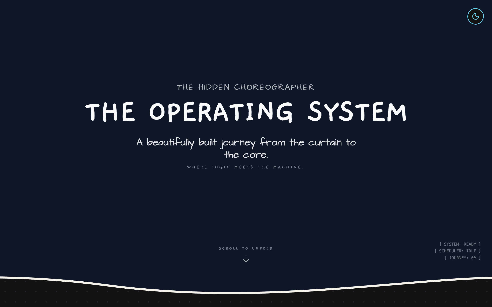

# CPU Scheduling Visualizer

An interactive, story-driven web application designed to help students and developers visualize, understand, and interact with Operating System CPU scheduling algorithms. 

## 🚀 Features

### Supported Scheduling Algorithms
The visualizer models the following algorithms (with predefined rulebooks and preemptive/non-preemptive variations):
* **First-Come, First-Served (FCFS)**
* **Shortest Job First (SJF)**
* **Shortest Remaining Time First (SRTF)**
* **Round Robin (RR)**
* **Priority Scheduling (Preemptive & Non-Preemptive)** with optional Priority Aging
* **Multi-Level Feedback Queue (MLFQ)**

### � Story-Driven Narrative (The Core)
The Home page acts as an interactive textbook, introducing the complex concepts of Operating Systems step-by-step:
* **The Rulebook:** Understand the metrics—Turnaround Time, Response Time, and Wait Time.
* **Preemption:** Learn the difference between letting a process finish and cutting it off mid-execution.
* **Algorithm Chapters:** Dedicated visual chapters explaining the evolution of scheduling, from simple FCFS up to the intelligent MLFQ. Each chapter explains the "why" and "how" of the CPU's decisions.

### 🛠️ Interactive Sandbox Mode
* **Live Sandbox:** Step away from the theory and test the algorithms yourself. 
* **Process Drafting Studio:** Create complex processes with varying arrival times, burst durations, and priority levels.
* **Real-time Canvas:** Watch the CPU execute your processes on an interactive Gantt chart.
* **Live Stats & Kernel Log:** View live metrics (Utilization, Throughput, Checkpoints) and a scrollable kernel log detailing context switches, IO waits, and process completions.

## 🏗️ Tech Stack
* **Frontend Component Setup:** React 19, TypeScript, Vite
* **Routing:** React Router v7
* **Styling:** Tailwind CSS v4 (featuring hand-drawn borders, custom CSS variables, and unique OS-themed typography)
* **Animations:** Framer Motion for smooth, hardware-accelerated UI transitions
* **Icons:** Lucide React

## 📦 Getting Started

### Prerequisites
Make sure you have Node.js (v18+) and npm installed.

### Installation

1. Clone the repository:
   \`\`\`bash
   git clone https://github.com/Pranay0083/CPU-Scheduler.git
   cd CPU-Scheduler
   \`\`\`

2. Install dependencies:
   \`\`\`bash
   npm install
   \`\`\`

3. Start the development server:
   \`\`\`bash
   npm run dev
   \`\`\`

4. Open your browser and navigate to \`http://localhost:5173\`

## 🤝 Contributing
Contributions, issues, and feature requests are welcome! Feel free to check the [issues page](https://github.com/Pranay0083/CPU-Scheduler/issues).

## 📄 License
This project is open-source and available under the MIT License.
